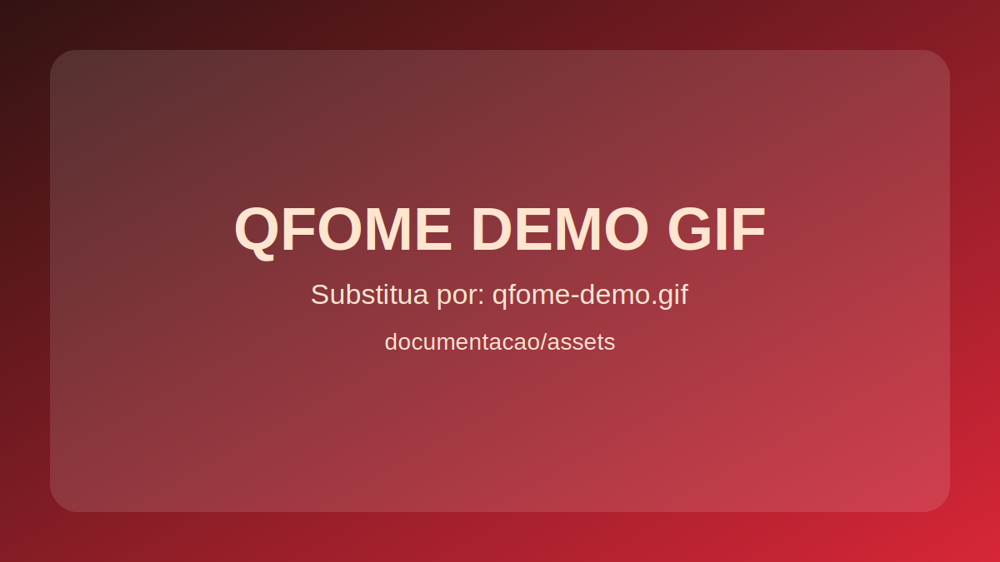
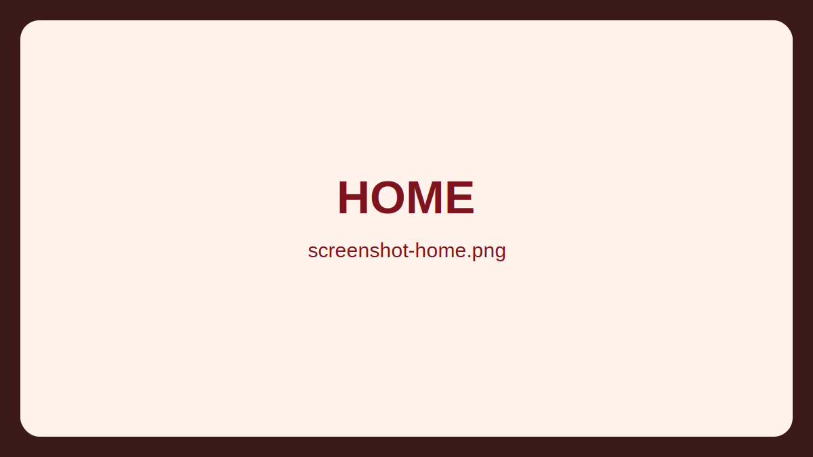
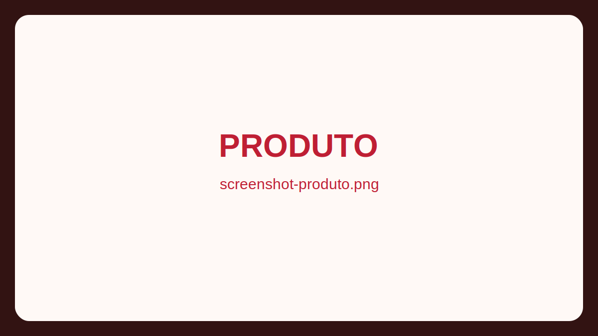
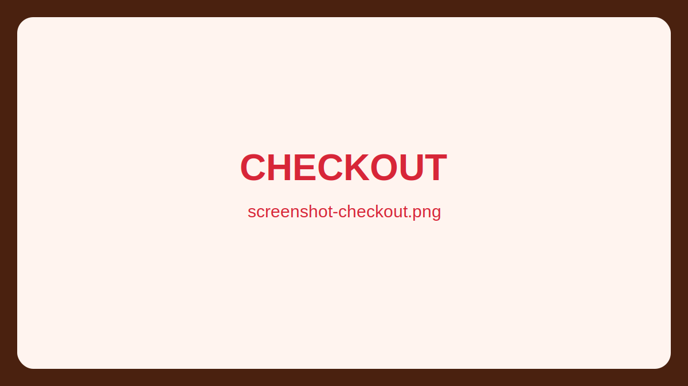
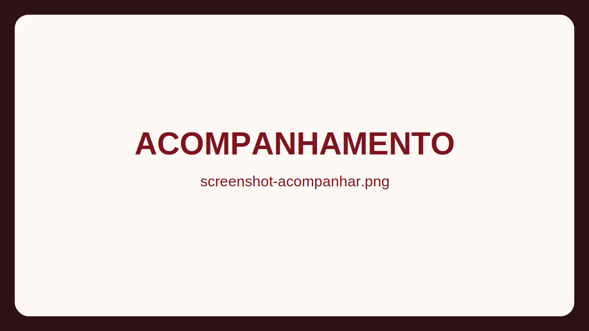

# QFOME


Matou a fome, chamou QFOME.

QFOME e uma plataforma de delivery criada para oferecer uma jornada completa de pedido: descoberta de pratos, personalizacao, carrinho, checkout, acompanhamento e area do cliente.

## Demo



Substitua pelo seu GIF real em `documentacao/assets/qfome-demo.gif` e atualize o link da imagem acima.

## Screenshots

| Home | Produto |
| --- | --- |
|  |  |

| Checkout | Acompanhamento |
| --- | --- |
|  |  |

Substitua os placeholders por capturas reais mantendo os mesmos nomes de arquivo, ou ajuste os links.

## Demo flow (portfolio)

1. Usuario entra na home, pesquisa pratos e navega por categorias.
2. Seleciona um produto, personaliza adicionais e salva no pedido.
3. Revisa carrinho, ajusta quantidades e confirma checkout.
4. Recebe codigo do pedido na tela de sucesso.
5. Acompanha status e historico na area do cliente.

## Visao do produto

A proposta do QFOME e unir experiencia visual forte com fluxo rapido de compra.

- Navegacao por categorias e cardapio completo.
- Pagina de produto com personalizacao (quantidade, adicionais e observacoes).
- Carrinho editavel com resumo de valores.
- Checkout com dados de entrega e forma de pagamento.
- Pos-checkout com codigo do pedido e tela de acompanhamento.
- Area do cliente com historico e ultimo pedido.

## Stack

- Frontend: Next.js 16, React 19, TypeScript, Tailwind CSS 4, Lucide Icons.
- Backend: Java 21, Spring Boot 3.5, Spring Web, Spring Data JPA, Validation, Actuator.
- Banco: H2 em arquivo local.

## Status real do MVP (abril/2026)

### Pronto e funcional

- UX completa do fluxo de compra no frontend.
- Login e cadastro conectando no backend (`/auth/register` e `/auth/login`).
- Backend com endpoints de catalogo, checkout e acompanhamento ja implementados.
- Testes de backend rodando com sucesso (`mvnw test`).

### Em evolucao

- Checkout e acompanhamento no frontend ainda usam `localStorage` como fonte principal.
- Integracao frontend -> endpoints reais de catalogo/checkout/pedidos ainda nao esta completa.
- Carrinho no backend ainda esta em modo placeholder.
- Auth backend ainda e MVP em memoria (sem persistencia em banco).

## Arquitetura atual

### Frontend (Next.js)

Fluxo principal em rotas:

- `/` home com destaques, categorias, busca e workspace de carrinho.
- `/cardapio` listagem completa de pratos.
- `/categoria/[slug]` pagina da categoria.
- `/produto/[slug]` detalhe e personalizacao de produto.
- `/pedido` carrinho.
- `/checkout` finalizacao do pedido.
- `/checkout/sucesso` confirmacao com codigo.
- `/acompanhar-pedido` timeline do pedido.
- `/entrar` login/cadastro.
- `/cliente` area do cliente.
- `/contato` e `/recuperar-acesso` suporte.

Observacao importante:

- O frontend hoje usa dados locais de cardapio (`src/data/*`) e estado de sessao/pedido no `localStorage` para simular o fluxo ponta a ponta.

### Backend (Spring Boot)

Backend principal do projeto: `qfome-backend/`

Endpoints atuais:

- `GET /actuator/health`
- `POST /auth/register`
- `POST /auth/login`
- `GET /categorias`
- `GET /produtos`
- `GET /produtos/{slug}`
- `POST /checkout`
- `GET /pedidos/cliente/{clienteId}`
- `GET /pedidos/acompanhar/{codigo}`
- `POST /carrinho/itens` (placeholder)
- `PATCH /carrinho/itens/{id}` (placeholder)
- `DELETE /carrinho/itens/{id}` (placeholder)
- `GET /carrinho/{clienteId}` (placeholder)

Limitacoes conhecidas do backend:

- Nao ha seed automatica de categorias/produtos/clientes no banco.
- Auth nao persiste em `clientes`; usuarios ficam em memoria enquanto a app roda.
- `POST /checkout` exige `clienteId` existente no banco.

## Estrutura do repositorio

```text
qfome-frontend/
  src/                    # app Next.js
  qfome-backend/          # backend Spring Boot principal
  documentacao/           # notas de andamento e riscos
  pom.xml                 # base backend legada no diretorio raiz
```

Nota: existe uma base Spring legada no diretorio raiz (`src/main/*` e `pom.xml`). Para o fluxo atual, considere `qfome-backend/` como backend principal.

## Como rodar localmente

### 1) Backend

No Windows (PowerShell/CMD):

```bash
cd qfome-backend
.\mvnw.cmd spring-boot:run
```

No Linux/macOS:

```bash
cd qfome-backend
./mvnw spring-boot:run
```

Backend em `http://localhost:8080`.

### 2) Frontend

Na raiz `qfome-frontend`:

```bash
npm install
npm run dev
```

Frontend em `http://localhost:3000`.

## Variaveis de ambiente (backend)

Arquivo de exemplo: `qfome-backend/.env.example`

```env
SERVER_PORT=8080
APP_CORS_ALLOWED_ORIGINS=http://localhost:3000,http://localhost:3001
```

Configuracao completa: `qfome-backend/src/main/resources/application.yml`

- H2 console: `http://localhost:8080/h2-console` (habilitacao via env).

## Qualidade e testes

Backend:

```bash
cd qfome-backend
.\mvnw.cmd test
```

Ja existe teste de integracao para health endpoint (`/actuator/health`).

## Roadmap sugerido

1. Conectar frontend aos endpoints reais de `categorias` e `produtos`.
2. Migrar checkout do `localStorage` para `POST /checkout`.
3. Persistir auth em banco (cliente) e remover mapa em memoria.
4. Implementar carrinho backend de fato (CRUD + regras de negocio).
5. Adicionar seed inicial de catalogo para ambiente de desenvolvimento.
6. Publicar colecao de testes de API e contrato de integracao frontend/backend.

## Documentacao complementar

- `documentacao/andamento-projeto-2026-03-23.md`
- `documentacao/riscos-e-mitigacao.md`
